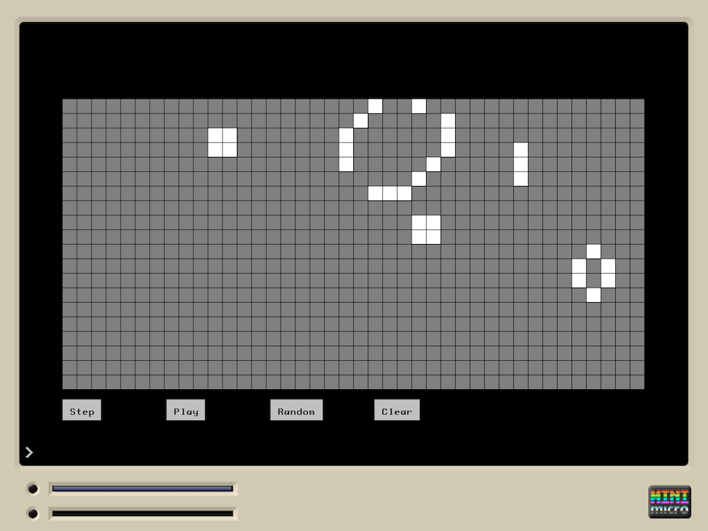

# Game of Life

This is game-of-life implementation for the [Mini Micro](https://miniscript.org/MiniMicro/index.html) virtual computer.

## Aspects covered

This game was done for illustration purposes, to learn about these Mini Micro aspects, among others:

* Tile display
* Scrolling the tile display
* Detecting mouse-clicks on a tile display
* Building basic UI components (buttos)
* Having a "play" loop with update intervals
